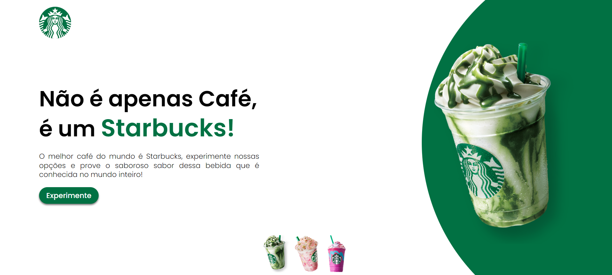
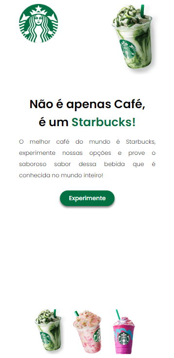

<h1>Landing Page Starbucks</h1>

<h5>Landing Page simples com ações e responsividade</h5>

<h4>Tecnologias usadas:</h4>

<h3>Link da aplicação <a href="https://lucasfgaldinos.github.io/landing-page-starbucks/">aqui</a></h3>

  
  

